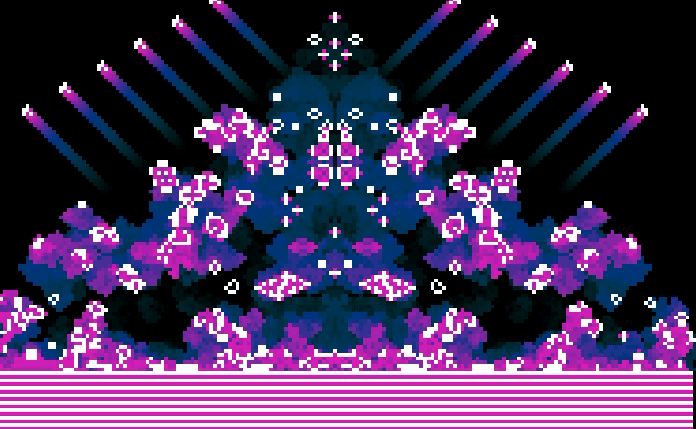

# Game-of-Life-X-Wolfram



The goal of this project (made in C) is to implement Wolfram's elementary cellular automaton and the famous Game of life. All Wolfram's rules are implemented (from 0 to 255). Wolfram's cells are given as input for the game of life.


I stored the map information inside of long longs variables for fun ! (and to train my bits skills)


## Installation
This project requires csfml version 2.5


## Building

Build with Makefile
```sh
make
```

## Usage
```sh
./gol [rule]
```

rule:   the ruleset to use (default value is 30).
